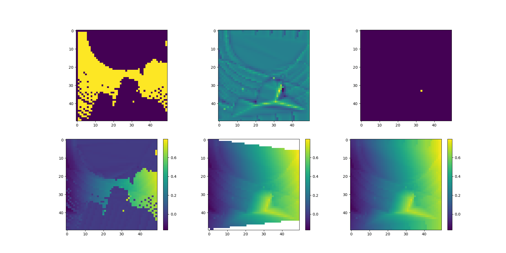
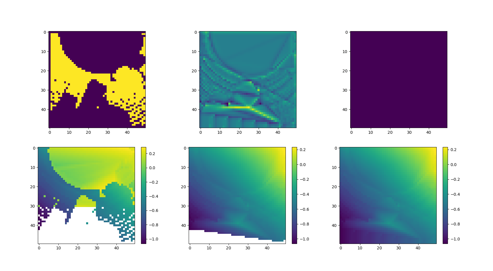

# Data Preparation

This directory contains all the scripts required for a our data preperation. In this step we convert an annotated 3d point cloud into an camera view extract and the associated ground plane. The plane will be used as ground truth for the training and the extraced camera view will be annotated and used as an input for the training process. 

The steps are:
- [loading the original dataset](#original-dataset)
- [augmentation of the data (+extracting fov)](#augmentation)
- [computation of ground plane](#computation-of-the-ground-plane)

## Motivation of Custom Version
For the training of the network we use a new ground truth computation compared to the original version. This is mainly to get rid of the falsly classified objects close to the ground, that existed mainly because of too high tolerances. In the original version the ground was elevated about half a meter over the actual ground and also smoothing was too big for an accurate prediction on everything beneath 0.5 to 1 m.

## Original Dataset
We are using the [SemanticKitti}(http://www.semantic-kitti.org/) Dataset. It consists out of 11 annotated LiDAR sequences and 11 further not annotated sequences. For the data preperations only the annotated sequecuences are used. 

Each sequence consists out of many frames of a driving car within a city environment. The velodyne data is just a point cloud and the labels have metadata for each point of the cloud.

### Loading a frame of the SemanticKitti data
The raw data consists out of the point clouds `.bin` and the label `.label` files. The point cloud is a raw binary file with each point being four 32-bit floating points `[x,y,z,r]` with r being the reflectivness of the lidar scan. For the GndNet that value will be discarded, because it won't be available when using camera data.

The `.lable` is a 32-bit integer for each point of the point cloud. It has an identifier for the use of timeseries (we won't be needing this) and more importantly the lower 16-bit represent the label numer as describes [here](#definition-of-ground).

## Augmentation
Before computing the ground plane, we are augmenting the data first. In the very first step a height variation (+/- 0.5m) is applied and a we are rotating the view direction. Additionally the whole map is slidly tilded to a random amount (+/- 5°) to simulate elevation which the original data is lacking. 

Once that part is done, a block of 10x10m² in the newly defined front is cut out and a field of view from a camera point of view is computed within that area. This is as close as it gets to the camera data we will be working on later on.

There is a script to demonstrate  the effect of the augmentation on a given point cloud and label file: 

```sh
python3 augmentation_demo.py --label=data/label.label --pcl=data/pcl.bin
```

## Computation of the Ground Plane

### Definition of Ground
First we need to segment the cloud into ground and non-ground, for this we use the SemanticKitti. For now we consider ground to be all points marked as:

`'road', 'parking', 'sidewalk', 'other-ground', 'lane-marking', 'terrain'`, which corresponds to the labels `[40, 44, 48, 49,60,72]`.

A complete list of all labels can be found [here](https://github.com/PRBonn/semantic-kitti-api/blob/master/config/semantic-kitti.yaml)

### Computation of the Plane
For this we only need the points that were classified as ground in the previous step. The main challange is to compute a plane that is just above almost all the ground points while ignoring outliers. The whole point cloud is quite noise, therefore the risk of having a ground plane to high above the actual plane is a very high. In addition we want the plane to be smooth and without significant elevation (this would defeat the purpose of a drivable ground). To achieve all this the algrithm constis of multiple steps.



#### 1. Heightmap
The first step is to split up the whole map into a grid of a fixed number of squares and compute the average height of each square. The squares that do not have any points, are masked out and the result is shown in the bottom left (all empty squares are shown as zero here).

#### 2. Linear Interpolation
The next step is to interpolate linearly between all existing points to fill gaps inbetween. This will leave all points at the edges that are not in between to valid data points as invalid. The result can be seen in the bottom middle graph. 

#### 3. Padding
For a complete ground map all the invalid points at the edges are filled with the same value as the neares valid square. This way the whole grid will be completed.

#### 4. Outlier detection
To avoid having single outliers in the data, we analyze the deviation of a square in regards to the average of its neighbours (using a 5x5 kernel for convolution), the result is visualized in the top in the middle. In this case there was a single point (square) that was much higher than all its neighbours and created a steep hill in the computed ground plane. This can be easily observed using a threshold. All points above the threshold are shown in the top right image. In case that map is not empty, the square is removed from the origial data and the ground plane computation is repeated. To avoid loops, this process is done a maximum of three times per frame.

After the outlier has been removed, the map looks like the following:


### Future Improvements
The ground plane is not very smooth yet. because of the linear interpolation it has plenty of edged at all the original points. In additon only extreme outliers are removed and many of smaller ones are still influencing the computed results. 

Points that could be improved:
- the height map computation: a more advanced approach than simply taking the average might be an idea
- Interpolation: A smoother version could be used to interpolate, or smoothe the results (at the risk of loosing details)
- Outlier removal: For now only a hard threshold is used and the difference to neightbours. Also the outlier detection only runs after all the other parts and requires a complete recomupation of the previous steps to remove an outlier (quite inefficient)